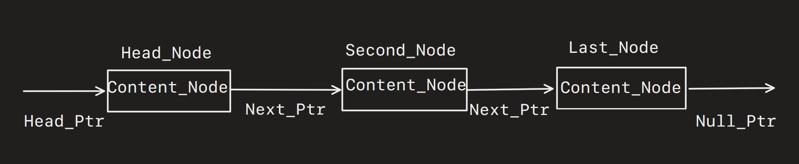

# Linked List implemented in C #

**Available functions**
- **Generate linked list**
- **Modify element**
- **Print list**

**Not finished**
- **Reverse linked list**

# Simple Linked List #

# Doubly Linked List #

